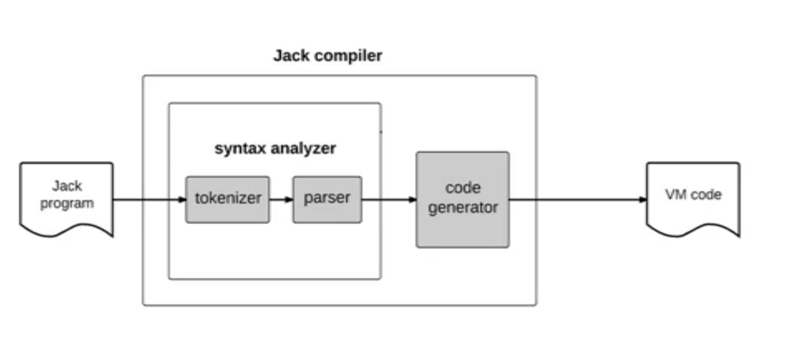
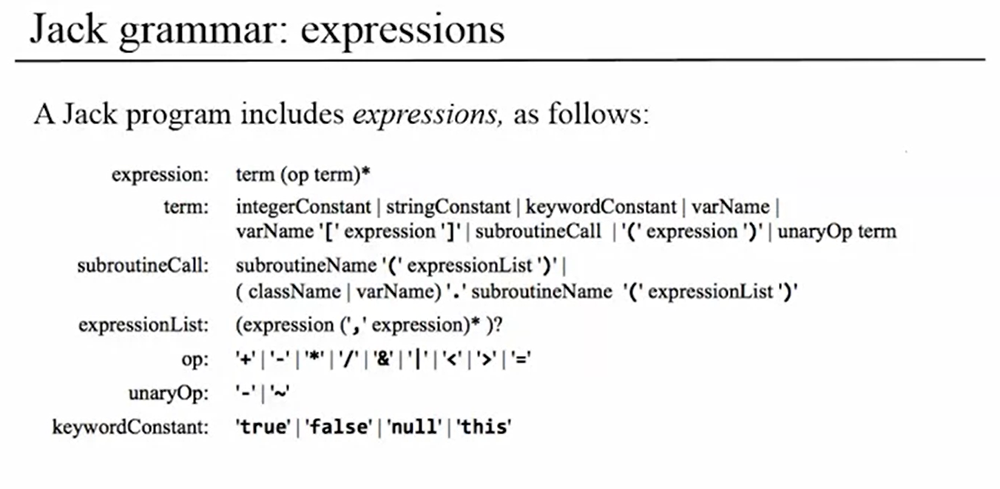
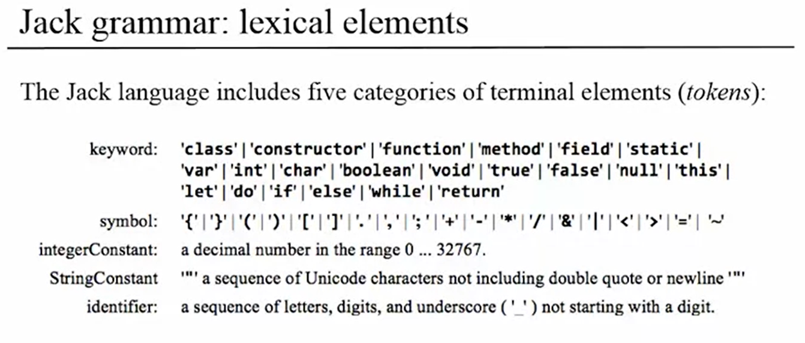
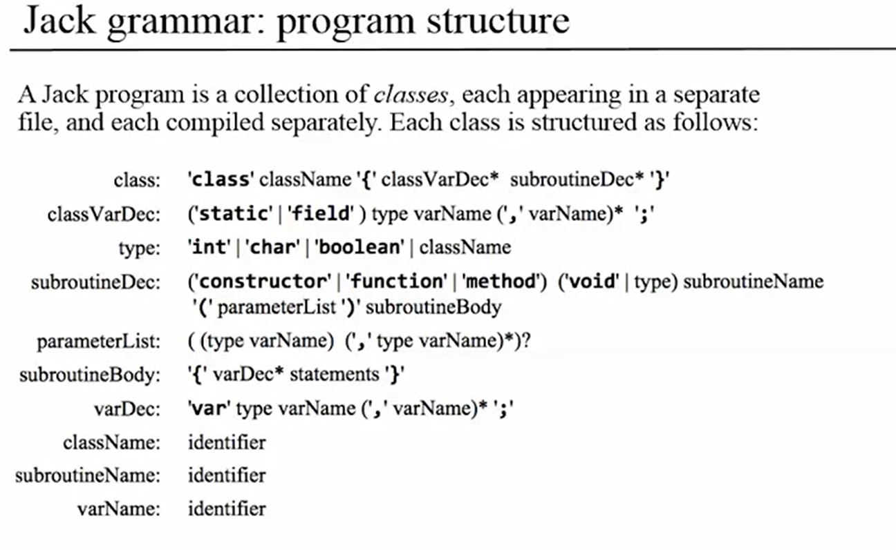
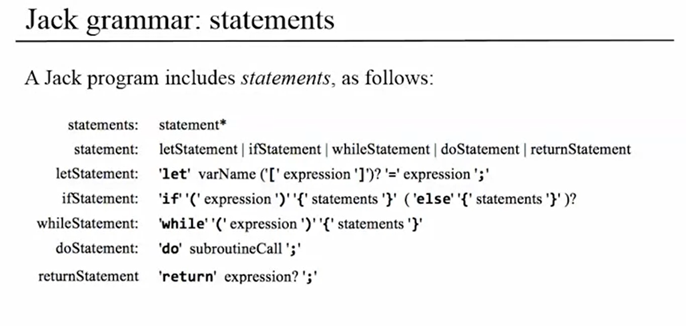

# Jack Compiler

Compiles Jack code into [Hack](https://www.nand2tetris.org) bytecode.

Jack is a simple object-based language that can be used to write high-level programs.
It has the basic features and flavor of modern object-oriented languages like Java, with a much
simpler syntax and no support for inheritance.

## Usage

```bash
# setup
npm i
npm run build

# compile single file
node build/index Main.vm

# compile directory
node build/index Pong

# include parse tree and tokens (XML)
node build/index Pong --parse-tree --tokens
```

## Architecture overview



## Grammar overview






## Notes

Improvements that `could` be made:

-   Better error handling with more precise syntax and semantic checks
-   Bytecode optimizations
